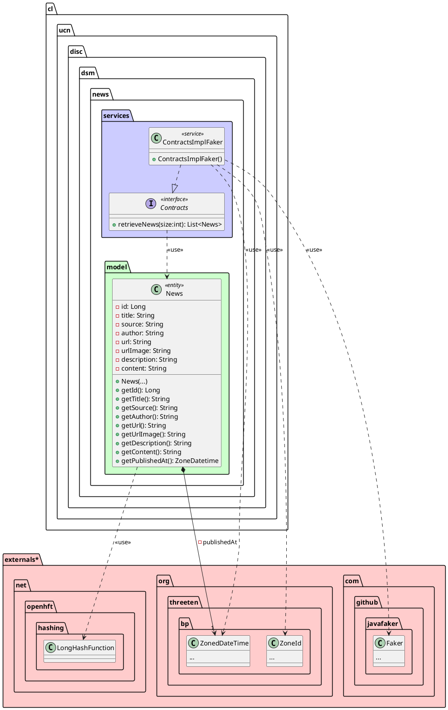

# The News Project

Android Project to show a list of News.

### Class Model

```puml
@startuml
package externals* #ffcccc{
    package org.threeten.bp{
        class ZonedDateTime{
            ...
        }
        class ZoneId{
            ...
        }
    }
    package net.openhft.hashing{
        class LongHashFunction{
        }
    }
    package com.github.javafaker{
        class Faker{
            ...
        }
    }

}

package cl.ucn.disc.dsm.news{
    package model #ccffcc {
    
        class News <<entity>>{
            - id: Long
            - title: String
            - source: String
            - author: String
            - url: String
            - urlImage: String
            - description: String
            - content: String
            + News(...)
            + getId(): Long
            + getTitle(): String
            + getSource(): String
            + getAuthor(): String
            + getUrl(): String
            + getUrlImage(): String
            + getDescription(): String
            + getContent(): String
            + getPublishedAt(): ZoneDatetime
        }
        News *--> "1" ZonedDateTime: - publishedAt
        News ..> LongHashFunction: <<use>>
    }
    
    package services #ccccff{
        interface Contracts <<interface>>{
            + retrieveNews(size:int): List<News>
        }
        Contracts ..> News : <<use>>
        
        class ContractsImplFaker <<service>> {
            + ContractsImplFaker()    
        }
        ContractsImplFaker ..|> Contracts
        ContractsImplFaker ..> ZonedDateTime : <<use>>
        ContractsImplFaker ..> ZoneId : <<use>>
        ContractsImplFaker ..> Faker : <<use>>
    }
}
@enduml
```

## Licence
[MIT](https://choosealicense.com/licenses/mit/)